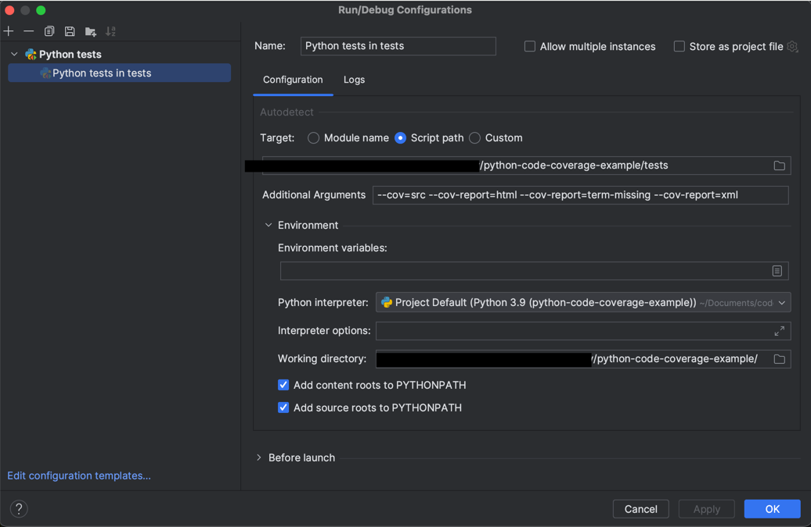
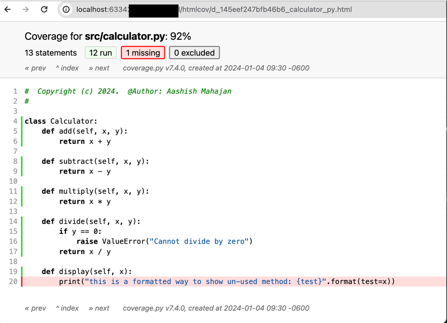
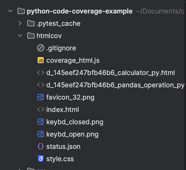
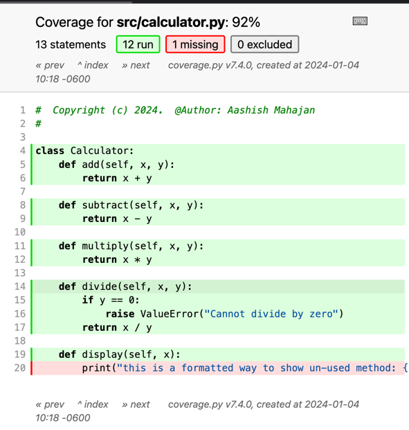

# RUNBOOK AND INSIGHT
- the code is specifically just an example how an effective pytest and code coverage can be integrated as a part of the code. 
- prerequisites:
  - python@3.9
  - source venv/bin/activate 
  - pip install pandas
  - pip install pytest
  - pip install pytest-cov

once the code is cloned in your local:
- set your current directory as the project root itself. 
- the test you are trying to execute using the command from current working directory using the command:
  - *{directory_path}*`/python-code-coverage-example/tests`
  - if using the intellij, please use the settings as follow:
    - 

**NOTES:**
- coverage can be generated in multiple format at the same time. 
- command explanation: 
  - `--cov=..src` : This points to the repo that needs to be validated for test code coverage.  
  - `--cov-exclude="tests/*,src/utils/*"` : This shows an example of how to ignore the test resource files from coverage.  
  - `--cov-report=term-missing` : This is resource that needs to be added for parameter such that, if u want the report to also show the code components that have not been tested.
    - 
  - `--cov-report=html`: This is to generate the report in HTML, if and when this is run the report would show index.html in directory itself such that one can open it in browser and navigate through report.
  - `--cov-fail-under=80` : This is to add a fail threshold to ensure then build agent can run the test and fail the build if test requirements are not met.  
    - permitted values such as : `--cov-report=xml`

**INFO:**
- once the coverage command is run using `pytest` a folder htmlcov would be created in the directory such that one can open index.html to see the report.
  - 
  - 